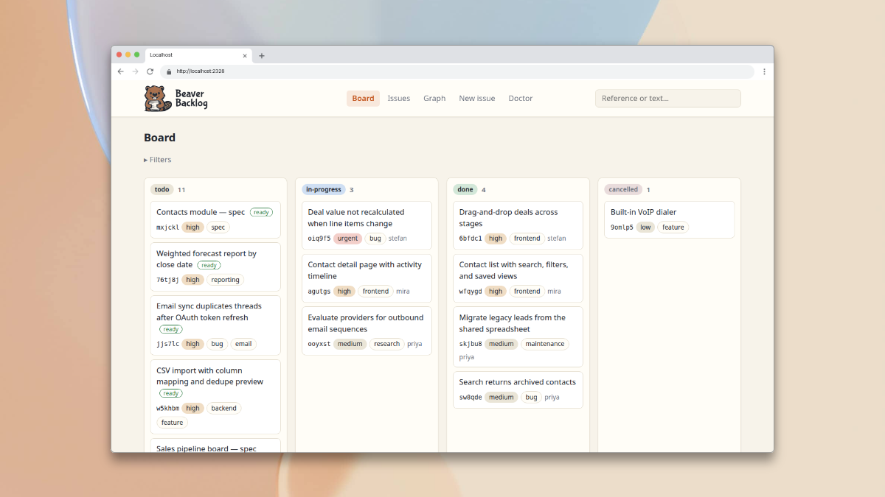
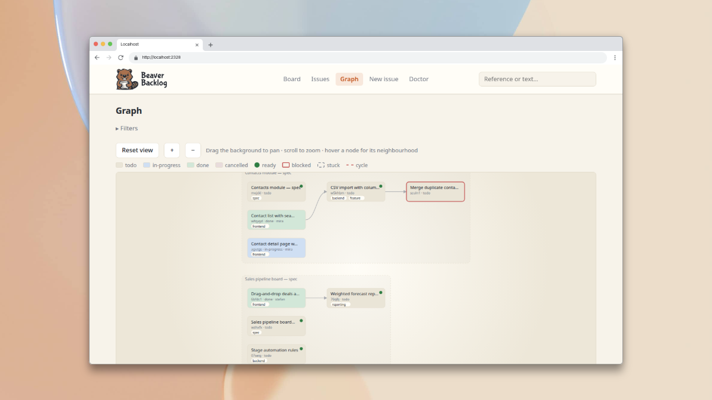
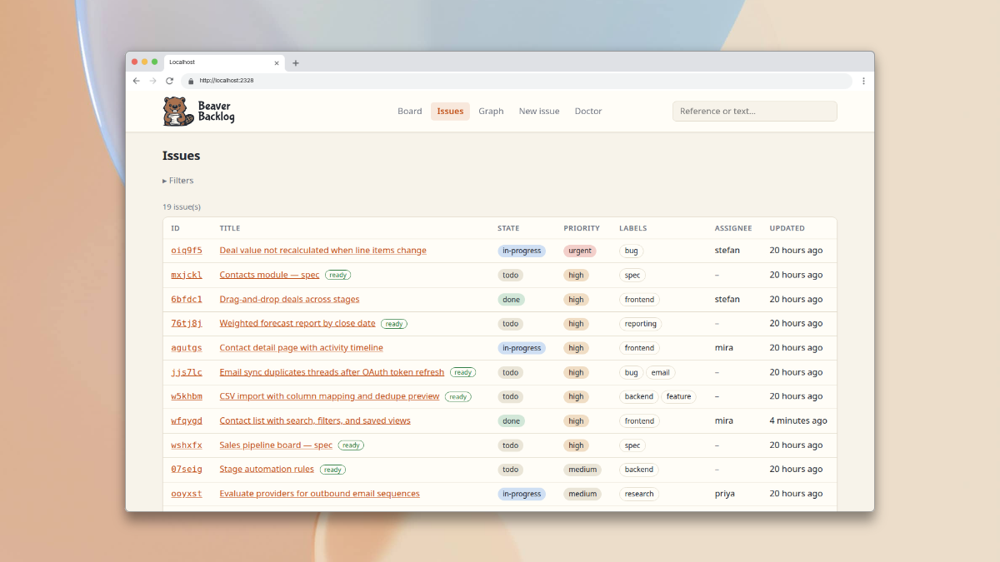
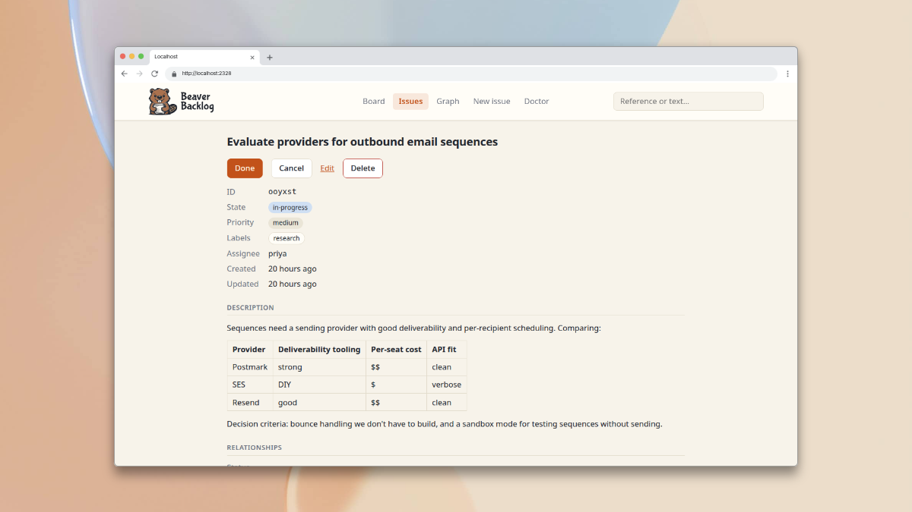
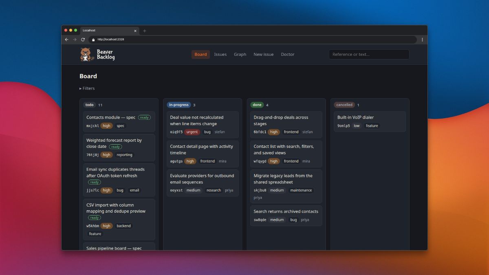
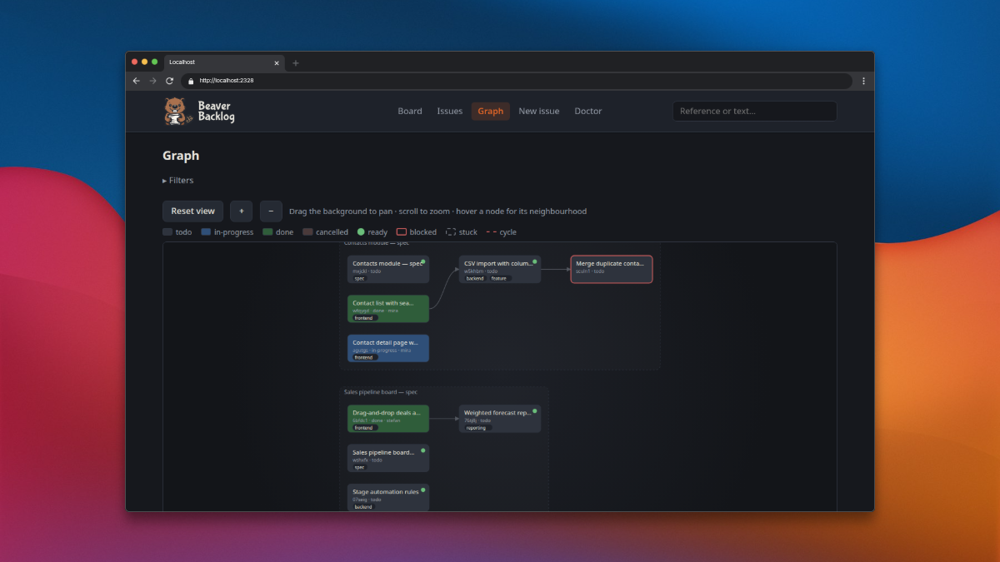

<p align="center">
  <picture>
    <source media="(prefers-color-scheme: dark)" srcset="docs/assets/logo-full-dark.svg">
    
  </picture>
</p>

<p align="center">
  <b>A local-first issue tracker that stores issues as Markdown files inside your project.</b><br>
  Humans and coding agents coordinate work through the files themselves.<br>
  No external service, account, or database needed.
</p>

<p align="center">
  <a href="https://github.com/builtbystef/beaver-backlog/actions/workflows/ci.yml"></a>
  <a href="LICENSE"></a>
  <a href="https://pkg.go.dev/github.com/builtbystef/beaver-backlog"></a>
</p>

<p align="center">
  <a href="#installation">Install</a> ·
  <a href="#quick-start">Quick start</a> ·
  <a href="#the-web-ui">Web UI</a> ·
  <a href="#screenshots">Screenshots</a> ·
  <a href="#commands">Commands</a> ·
  <a href="#for-scripts-and-agents">Agents</a> ·
  <a href="#documentation">Docs</a>
</p>

---

```console
$ beaver create "Login form rejects valid passwords" --label bug --priority high
Created ix2guj  Login form rejects valid passwords
  .beaver/issues/ix2guj-login-form-rejects-valid-passwords.md
```

## Why Beaver Backlog?

Most issue trackers live outside the codebase, behind a web app and an API.
Beaver Backlog keeps project work _in_ the repository, as plain files that travel
with your code:

- **Markdown-first**: every issue is a human-readable `.md` file with a small
  YAML header. Read it, edit it, diff it, and review it like any other file.
- **Local by default**: issues live on your disk, in your project.
- **Version-control-friendly**: plain text that Git diffs and
  merges cleanly.
- **Agent-friendly**: coding agents read, create, and update issues through
  the same files as you.
- **Nothing hidden**: the files are the only source of truth. The CLI and the
  web UI are thin clients over them; hand-editing an issue file is a
  first-class operation.

## Installation

### macOS and Linux

```sh
curl -fsSL https://raw.githubusercontent.com/builtbystef/beaver-backlog/main/install.sh | sh
```

The binary lands in `~/.local/bin/beaver`; set `BEAVER_INSTALL_DIR` to install
somewhere else. When that directory is not on your `PATH`, the script prints
the line to add to your shell profile.

### Windows

```powershell
irm https://raw.githubusercontent.com/builtbystef/beaver-backlog/main/install.ps1 | iex
```

`beaver.exe` lands in `%LOCALAPPDATA%\Programs\beaver`, which the script adds to
your user `PATH`. No administrator rights are needed; open a new shell
afterwards to pick up the `PATH` change.

Neither installer needs a Go toolchain. Both verify the download's SHA-256
against the release's published checksums file, and install nothing if it does
not match.

By default you get the latest release. To install a specific one:

```sh
curl -fsSL https://raw.githubusercontent.com/builtbystef/beaver-backlog/main/install.sh | sh -s -- --version 1.0.0
```

```powershell
$env:BEAVER_VERSION = '1.0.0'; irm https://raw.githubusercontent.com/builtbystef/beaver-backlog/main/install.ps1 | iex
```

### With a Go toolchain

If you already have Go 1.26 or later:

```sh
go install github.com/builtbystef/beaver-backlog/cmd/beaver@latest
```

Or build from a clone:

```sh
git clone https://github.com/builtbystef/beaver-backlog.git
cd beaver-backlog
go build ./cmd/beaver
```

These builds report their version as `dev`, since the version is stamped in at
release time.

## Quick start

```console
$ beaver init
Initialized empty Beaver Backlog store in /home/you/project/.beaver

$ beaver create "Login form rejects valid passwords" --label bug --priority high
Created ix2guj  Login form rejects valid passwords
  .beaver/issues/ix2guj-login-form-rejects-valid-passwords.md

$ beaver list
ID      PRIORITY  STATE  ASSIGNEE  LABELS  TITLE
ix2guj  high      todo   -         bug     Login form rejects valid passwords

$ beaver start ix2guj
Started ix2guj (claimed for stefan)

$ beaver note ix2guj "root cause: form strips ! before hashing"
Added note to ix2guj as stefan

$ beaver update ix2guj --priority urgent --label regression
Updated ix2guj

$ beaver done ix2guj
Marked ix2guj done
```

State changes are verbs of their own (`start`, `done`, `cancel`, `reopen`);
every other field — title, description, assignee, priority, labels,
relationships — changes through `beaver update`.

## The web UI

`beaver serve` starts a local web UI on loopback over the same files. It uses
port 2328 by default and scans forward if that port is occupied (override it
with `--port`). No daemon and no build step; stop it with Ctrl-C.

- **Board** — issues as cards in state columns; drag a card to move it.
- **List** — the same issues as a table, sharing one filter bar with the board
  (label, priority, assignee, text search).
- **Graph** — the dependency graph as a server-rendered picture: layered
  layout, parent clusters, dependency arrows; pan, zoom, and filter it.
- **Issue pages** — rendered Markdown descriptions and notes, every field
  editable, plus creating new issues in the browser.
- **Doctor** — store health as a page, with the same safe repair as
  `doctor --fix`.

Open pages notice when the store changes underneath them — a pull, a hand
edit, another actor — and redraw themselves. Every control is a plain HTML
form first, so the UI keeps working with JavaScript disabled; scripts only
add polish on top. The UI follows your system's light or dark theme, and
writes are attributed just like CLI writes (`beaver serve --as <actor>`).

### Screenshots

|                          The board                          |                             The graph                             |
| :---------------------------------------------------------: | :---------------------------------------------------------------: |
|        |    |
|                      **The issue list**                       |                         **An issue page**                         |
|  |  |
|                     **Dark mode: board**                      |                        **Dark mode: graph**                       |
|  |  |

## The issue file

Each issue is one file in `.beaver/issues/`, named `<id>-<slug>.md` for
readability. The short random ID is the identity; the slug just mirrors the
title.

```markdown
---
id: ix2guj
title: Login form rejects valid passwords
state: done
assignee: stefan
priority: high
labels:
  - bug
created: 2026-07-06T20:28:40Z
updated: 2026-07-06T20:28:59Z
---

When a user submits a correct password containing a `!`, the form clears and
shows "invalid credentials". Expected: the login succeeds.

## Notes

**stefan** — 2026-07-06T20:28:59Z

root cause: form strips ! before hashing
```

The frontmatter is machine-owned (Beaver Backlog keeps it formatted,
and unknown keys you add by hand are preserved verbatim, never interpreted);
the issue body is yours (Beaver Backlog only ever appends notes to it). State is one of
`todo`, `in-progress`, `done`, or `cancelled` — cancelled meaning deliberately
abandoned, kept visible so nobody re-files it. Any state may move to any
other; the tracker records reality rather than enforcing a workflow.

## Commands

Fifteen of them, and they fit on one screen:

| Command                      | What it does                                                                                                   |
| ---------------------------- | -------------------------------------------------------------------------------------------------------------- |
| `beaver init`                | Initialize a store in the current project                                                                      |
| `beaver create "<title>"`    | Create an issue (`--body`, `--body-file`, `--label`, `--priority`, `--depends-on`, `--parent`)                 |
| `beaver list`                | List issues (`--state`, `--ready`, `--blocked`, `--label`, `--priority`, `--assignee`, `--parent`, `--search`) |
| `beaver show <ref>`          | Show an issue, including what it waits on and whether it is ready                                              |
| `beaver start <ref>`         | Move to in-progress, auto-claiming if unowned                                                                  |
| `beaver done <ref>`          | Mark done                                                                                                      |
| `beaver cancel <ref>`        | Deliberately abandon (terminal, but not completed)                                                             |
| `beaver reopen <ref>`        | Return an issue to todo, clearing its assignee                                                                 |
| `beaver update <ref>`        | Change any non-state field (see below)                                                                         |
| `beaver note <ref> "<text>"` | Append an attributed, timestamped note                                                                         |
| `beaver delete <ref>`        | Delete the file (for junk; the VCS keeps history)                                                              |
| `beaver doctor`              | Check store health; `--fix` repairs what is safe to repair                                                     |
| `beaver serve`               | Serve the local web UI on loopback until interrupted (`--port`, `--as`)                                        |
| `beaver whoami`              | Print the actor you resolve as                                                                                 |
| `beaver version`             | Print the version, commit, and date of this build                                                              |

`update` takes as many fields as you like in one invocation, and writes
nothing at all if they net out to no change:

| Flag                                   | What it changes                                                  |
| -------------------------------------- | ---------------------------------------------------------------- |
| `--title <text>`                       | The title, renaming the file to the fresh slug (the ID is fixed) |
| `--body <text>` / `--body-file <path>` | The description, leaving the `## Notes` section untouched        |
| `--assignee <actor>` / `--unassign`    | The assignee                                                     |
| `--priority <level>`                   | Priority (`urgent`–`low`, or `none` to clear)                    |
| `--label <spec>`                       | Labels: `bug` or `+bug` adds, `-bug` removes; repeatable, CSV    |
| `--depends-on <spec>`                  | Blocking edges, by ref, with the same `+`/`-` syntax             |
| `--parent <ref>` / `--no-parent`       | The parent issue                                                 |

A `<ref>` is an issue's ID, its slug, or its file name — resolved by exact
match only, never by prefix or fuzzy match. Run `beaver help` for full usage.

## For scripts and agents

Output format auto-detects: human-readable tables on a terminal, JSON when
piped (override with `--format human|json`). Exit codes are stable — `0`
success, `1` runtime failure, `2` usage error, `3` issue or store not found.

Every mutation is attributed to an **actor** — a free-form name; humans and
agents are treated identically. Identity resolves from `--as`, then the
`BEAVER_BACKLOG_ACTOR` environment variable, then per-machine user config (a
human is prompted once, in a terminal). Set `BEAVER_BACKLOG_ACTOR` in an agent's
environment and every claim and note it makes is attributed correctly.

A complete issue — title, description, and metadata — is one command: pass a
short description inline with `--body`, or pipe multi-line Markdown through
`--body-file -` (a path works too) and skip the shell quoting:

```console
$ beaver create "Login form rejects valid passwords" --label bug --priority high --body-file - <<'EOF'
When a user submits a correct password containing a `!`, the form clears and
shows "invalid credentials". Expected: the login succeeds.
EOF
Created t4y1gv  Login form rejects valid passwords
  .beaver/issues/t4y1gv-login-form-rejects-valid-passwords.md
```

Routine upkeep is likewise one command rather than a sequence — `update` takes
every field it changes at once, and reports the result in the same single-issue
JSON shape the lifecycle verbs use:

```console
$ beaver update t4y1gv --priority urgent --label regression,-needs-triage --assignee agent-7
Updated t4y1gv
```

### Editing an issue's description

Nothing here needs a terminal or an `$EDITOR`. To rewrite a description,
`beaver update <ref> --body "<markdown>"` replaces it and leaves the
`## Notes` section byte-identical; `--body-file <path>` reads it from a file,
and `--body-file -` from stdin, which is the way to send multi-line Markdown
without shell quoting:

```console
$ beaver update t4y1gv --body-file - <<'EOF'
Submitting a correct password containing a `!` clears the form and shows
"invalid credentials". Expected: the login succeeds.
EOF
Updated t4y1gv
```

**Editing the issue file directly is equally first-class** — the files are the
source of truth, and that is the interactive path this tool deliberately does
not wrap in a command. Three rules keep a hand edit safe:

- **Leave the `## Notes` section alone.** It is the append-only coordination
  journal; rewriting or dropping another actor's entries breaks the contract.
  Edit the description above it, and add your own entries only through
  `beaver note`.
- **Never change the `id` field** — it is the issue's identity, and the
  filename merely mirrors it.
- **Follow up with `beaver note <ref> "<what you changed>"`.** A hand edit
  alone does not bump the `updated` timestamp; a note both journals the change
  for other actors and bumps it.

`beaver doctor` is the net under all of it: run it after a hand edit and it
reports anything the edit left behind. Whatever drifts anyway — say a filename
gone stale after a hand-retitle — is lint, not corruption, and
`doctor --fix` repairs it.

## Coordinating parallel work

Beaver Backlog is local-first and has no sync layer, so it cannot _lock_ an
issue. Instead an actor **claims** one by setting its `assignee` field, and
that claim travels through the VCS like any other change. It is a signal, not
a rule: two actors on different branches can claim the same issue, and the
merge surfaces the clash. Push claims early and integrate often.

Give each concurrent agent its **own working tree** (a separate `git worktree`
or clone). Two agents sharing one checkout can silently overwrite each other's
edits — that configuration is unsupported.

Issues relate through `depends_on` and `parent`, stored one-sided on the
dependent or child. `beaver list --ready` shows what is actionable now (todo,
every dependency done); `--blocked` shows what is waiting.

## Keeping the store healthy

Distributed, hand-editable files can drift: filenames out of sync with titles,
dangling references after a bad merge, dependency cycles, typo'd frontmatter
keys. Everyday commands degrade gracefully — an invalid file is skipped with a
warning, never a crash — and `beaver doctor` reports everything it finds.
`doctor --fix` repairs only what is unambiguous (like drifted filenames) and
never removes data.

## Documentation

- [`docs/GLOSSARY.md`](docs/GLOSSARY.md) — the project's language: what an
  issue, actor, claim, and note precisely mean.
- [`docs/TRACKER.md`](docs/TRACKER.md) — the conventions this repository uses
  to track its own work with Beaver Backlog.
- [`docs/ARCHITECTURE.md`](docs/ARCHITECTURE.md) — the modules and the seams
  between them.
- [`docs/CODING_STANDARDS.md`](docs/CODING_STANDARDS.md) — the coding and test
  conventions used by contributors.
- [`docs/adr/`](docs/adr/) — the architecture decisions behind the design and
  their tradeoffs.

## Status

Beaver Backlog is now at **1.0.0**. It will continue to evolve, but compatibility
matters: changes to the issue file format, commands, flags, machine-readable
output, and other public behavior will aim to remain backward-compatible.
Unavoidable breaking changes may still happen, but they will be kept to a
minimum and called out clearly.

## Contributing

Contributions are welcome — see [`CONTRIBUTING.md`](CONTRIBUTING.md) for how
to build, test, and submit changes.

## License

[MIT](LICENSE)
